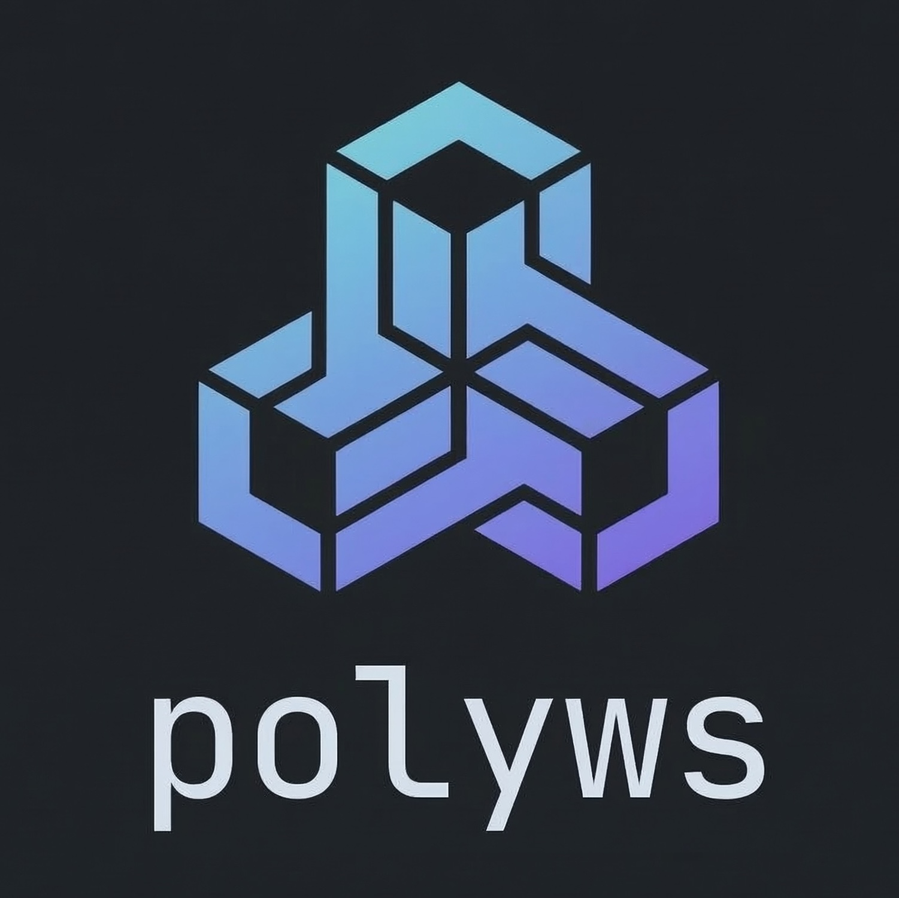

# polyws

<p align="center">
  
</p>

**Polyrepo Workspace Orchestrator**
<p align="center">
  <a href="https://github.com/cmdworks/polyws/actions/workflows/ci.yml"></a>
  <a href="https://github.com/cmdworks/polyws/releases/latest"></a>
  <a href="LICENSE"></a>
  <a href="https://www.rust-lang.org"></a>
  <a href="https://cmdworks.github.io/polyws/"></a>
</p>
---

> Built while developing the [Rove ecosystem](https://github.com/rovehq/core) — a polyrepo setup where multiple projects live side-by-side. Existing tools fell short, so **polyws** was born: a single binary that orchestrates many repos as one unified workspace.

Website: [https://cmdworks.github.io/polyws/](https://cmdworks.github.io/polyws/) (deployed via GitHub Pages CI)

## Install

```bash
curl -fsSL https://raw.githubusercontent.com/cmdworks/polyws/main/install.sh | bash
```

Install as a custom name (`poly`, `polyws`, or anything you prefer):

```bash
# interactive — prompts for a name when run in a terminal
curl -fsSL https://raw.githubusercontent.com/cmdworks/polyws/main/install.sh | bash

# non-interactive — set polyws_NAME env var
polyws_NAME=poly    curl -fsSL https://raw.githubusercontent.com/cmdworks/polyws/main/install.sh | bash
polyws_NAME=polyws  curl -fsSL https://raw.githubusercontent.com/cmdworks/polyws/main/install.sh | bash
```

Use whichever name you chose:

```bash
poly init
poly add core git@github.com:org/core.git
poly pull
poly            # TUI
```

**Uninstall:**

```bash
curl -fsSL https://raw.githubusercontent.com/cmdworks/polyws/main/uninstall.sh | bash
# or, if installed as poly:
polyws_NAME=poly curl -fsSL https://raw.githubusercontent.com/cmdworks/polyws/main/uninstall.sh | bash
```

Windows: download the `.zip` from [Releases](https://github.com/cmdworks/polyws/releases/latest).

---

## Platforms

| Platform | Architecture | Binary |
|----------|-------------|--------|
|  | x86\_64 | `polyws-x86_64-unknown-linux-gnu.tar.gz` |
|  | aarch64 | `polyws-aarch64-unknown-linux-gnu.tar.gz` |
|  | arm64 | `polyws-aarch64-apple-darwin.tar.gz` |
|  | x86\_64 | `polyws-x86_64-pc-windows-msvc.zip` |
|  | aarch64 | `polyws-aarch64-pc-windows-msvc.zip` |

---

## Quick Start

```bash
cd my-workspace/
polyws doctor              # validate environment (git, ssh, disk, internet)
polyws init                # create workspace config
polyws add core git@github.com:org/core.git
polyws add plugins git@github.com:org/plugins.git --depends-on core --sync-url git@gitlab.com:backup/plugins.git
polyws pull                # safe clone / update all repos
polyws push plugins        # push one project to origin
polyws exec "cargo build"  # run a command in every repo, in parallel
polyws status              # branch + dirty-file count per repo
```

---

## Configuration

polyws accepts workspace config in JSON or TOML using any of these names:
`.polyws`, `.poly`, `.polyws.json`, `.poly.json`, `.polyws.toml`, `.poly.toml`

```json
{
  "name": "my-workspace",
  "sync_interval_minutes": 30,
  "projects": [
    {
      "name": "core",
      "url": "git@github.com:org/core.git",
      "branch": "main",
      "sync_url": "git@gitlab.com:backup/core.git"
    },
    {
      "name": "plugins",
      "url": "git@github.com:org/plugins.git",
      "branch": "main",
      "depends_on": ["core"],
      "sync_url": "git@gitlab.com:backup/plugins.git"
    }
  ],
  "vm": {
    "host": "dev-box",
    "user": "ubuntu",
    "path": "~/workspace",
    "sync": "mutagen",
    "dependencies": ["git", "rust", "cargo"]
  }
}
```

<details>
<summary>Field reference</summary>

| Field | Type | Description |
|---|---|---|
| `name` | string | Human-readable workspace name |
| `sync_interval_minutes` | number | Default mirror sync interval |
| `projects[].name` | string | Local directory name |
| `projects[].url` | string | Primary Git remote |
| `projects[].branch` | string | Branch to track (default: `main`) |
| `projects[].depends_on` | string[] | Projects that must complete first |
| `projects[].sync_url` | string | Mirror / backup remote |
| `projects[].sync_interval` | number | Per-project interval override (minutes) |
| `vm.host` | string | SSH hostname |
| `vm.user` | string | SSH username |
| `vm.path` | string | Remote workspace path |
| `vm.sync` | string | `mutagen` or `rsync` |
| `vm.dependencies` | string[] | Packages to install on `vm setup` |

</details>

---

## Commands

### Workspace

| Command | Description |
|---|---|
| `polyws init` | Create a workspace config in the current directory |
| `polyws add <name> <url>` | Add a project (`--branch`, `--depends-on`, `--sync-url`) |
| `polyws remove <name>` | Remove a project |
| `polyws list` | List all projects and branches |
| `polyws pull [name] [--force]` | Clone missing repos; safe pull existing repos (`--force` allows hard reset) |
| `polyws clone [name] [--force]` | Alias for `pull` |
| `polyws push [name]` | Push local branch to `origin` (one project or all) |
| `polyws status` | Branch + dirty-file count per repo |
| `polyws graph` | Print the dependency tree |
| `polyws repair` | Re-clone missing repos; fix origin URLs |
| `polyws bootstrap` | `doctor` + `pull` in one step |

### Execution

```bash
polyws exec "cargo test"           # runs in every repo
polyws exec "git log --oneline -5"
```

Repos at the same dependency level run **in parallel** (rayon). Deeper levels wait for shallower ones to finish.

### Snapshots

```bash
polyws snapshot create          # save current HEAD of every repo
polyws snapshot list            # list all saved snapshots
polyws snapshot restore <file> --dry-run  # preview restore plan
polyws snapshot restore <file> -y         # restore without prompt
```

### Mirror Sync

```bash
polyws sync start    # background daemon: periodic git push --mirror to sync_url
polyws sync stop     # stop the daemon
polyws sync status   # check daemon status
polyws sync now      # run one pass immediately
```

### Doctor

```bash
polyws doctor   # checks: git · ssh · rustc · cargo · internet · workspace · disk
```

### VM

```bash
polyws vm setup          # install deps, create workspace directory on remote
polyws vm sync-start     # start mutagen/rsync session to the VM
polyws vm sync-stop      # stop sync
polyws vm exec "<cmd>"   # run a command on the remote host inside vm.path
polyws vm shell          # open an interactive SSH shell
polyws vm doctor         # validate remote environment
polyws vm reset          # delete + recreate the remote workspace (5 s grace)
```


## Dependency Graph

```
core
├─ plugins
├─ registry
└─ cloud
```

`polyws graph` visualises the tree. `polyws exec`, `polyws pull`, and `polyws push` respect it — `plugins`, `registry`, and `cloud` only start after `core` finishes.

---

## Project Layout

```
src/
├── main.rs       entry point — routes CLI commands
├── cli.rs        clap definitions
├── config.rs     WorkspaceConfig + topological sort
├── workspace.rs  init · add · remove · pull · push · status · graph · repair
├── git.rs        clone · pull · push · mirror push
├── exec.rs       parallel cross-repo execution (rayon)
├── sync.rs       mirror-sync daemon
├── doctor.rs     environment checks
├── snapshot.rs   snapshot create / restore / list
├── utils.rs      coloured output helpers
└── vm/
    ├── mod.rs        doctor · setup · sync · reset
    ├── ssh.rs        SshSession wrapper
    ├── detect_os.rs  OsType detection from uname / os-release
    ├── installer.rs  remote package install per OS
    └── executor.rs   exec_on_vm · open_shell
```

---

## Key Dependencies

| Crate | Purpose |
|---|---|
| `clap` | CLI parsing |
| `serde_json` | Config serialisation |
| `tokio` | Async runtime (sync daemon) |
| `rayon` | Parallel repo execution |
| `git2` | Libgit2 bindings |
| `chrono` | Snapshot timestamps |
| `anyhow` | Error handling |

---

## Build from Source

```bash
git clone https://github.com/cmdworks/polyws
cd polyws
cargo build --release
cp target/release/polyws /usr/local/bin/
```

---

<div align="center">
<sub>Made with ♥ for the <a href="https://github.com/rovehq/core">Rove ecosystem</a></sub>
</div>
